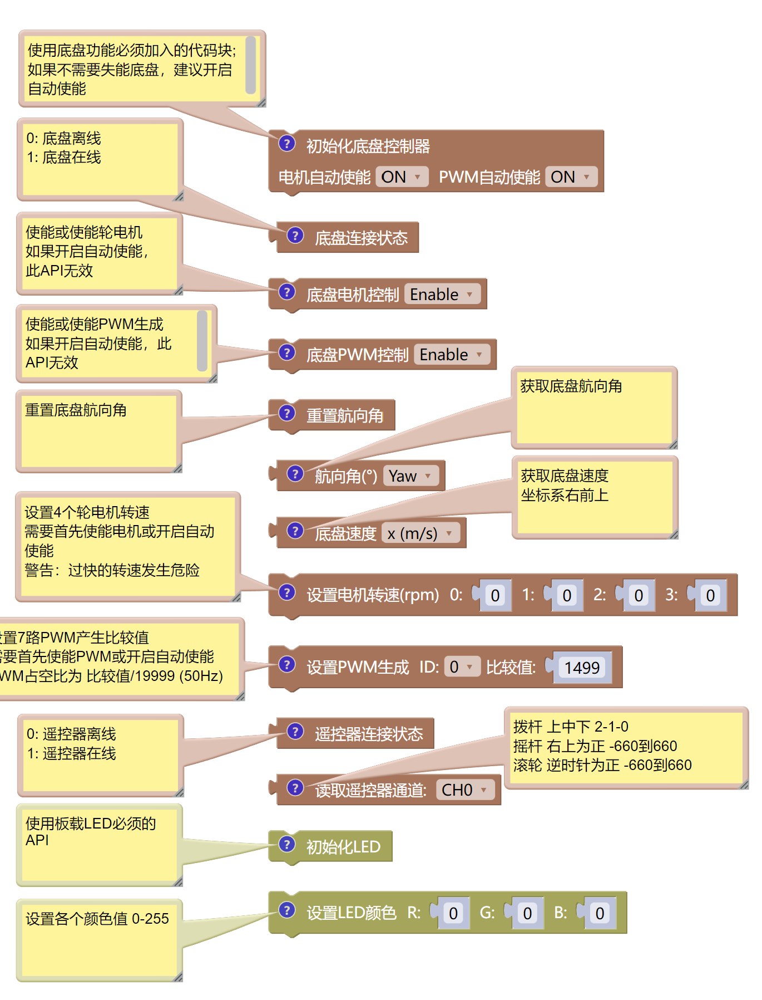

<!--
 * @Description: 
 * @Author: qianwan
 * @Date: 2024-01-28 16:46:27
 * @LastEditTime: 2024-01-28 17:23:04
 * @LastEditors: qianwan
-->
# LibFishChassis Package
*深圳科创学院2024高中生机器人冬令营 Mixly支持包*   
*InnoXSZ 2024 Robotics Winter Camp for High School Students.* 

> LibFishChassis is provided as a software package.

>Author: qianwan.Jin@2024
qianwan233@foxmail.com


Get this repository by:   
```bash                                     
git clone https://github.com/Q1anWan/LibFishChassis --recursive --depth=1
```

Mixly2软件下载:     
https://mixly.org/bnu-maker/mixl2.0rc   

Mixly常见问题链接:      
http://maker.peien.xyz/blog/28   
 


## LibChassis的API
### 底盘控制API解析

具体使用请看示例程序



